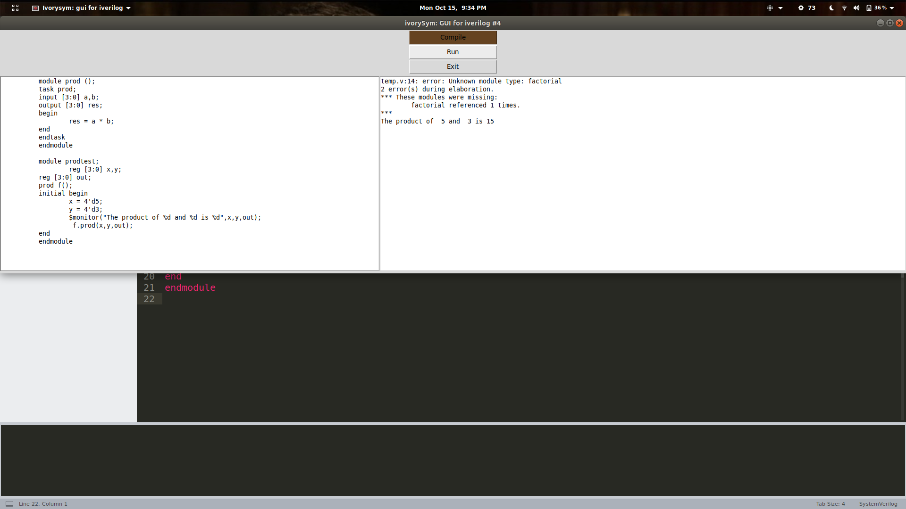

# ivorySYM
A GUI simulator for verilog

### Building with
* Python 2.7.15rc1
* Tkinter

#### Run
`git clone`    
`python mainloop.py`

 The software is at its infancy and currently supports compiling and running of single .v files only.
 
 **To add:**
 * Save and open features, showing current file name, etc.
 * Working with multiple files
 * Anything other idea that pops up.
 * UI design
 
 
 
 
 
 
 _Feel free to contribute_
 _Open up a PR or issues link if you find any errors._
